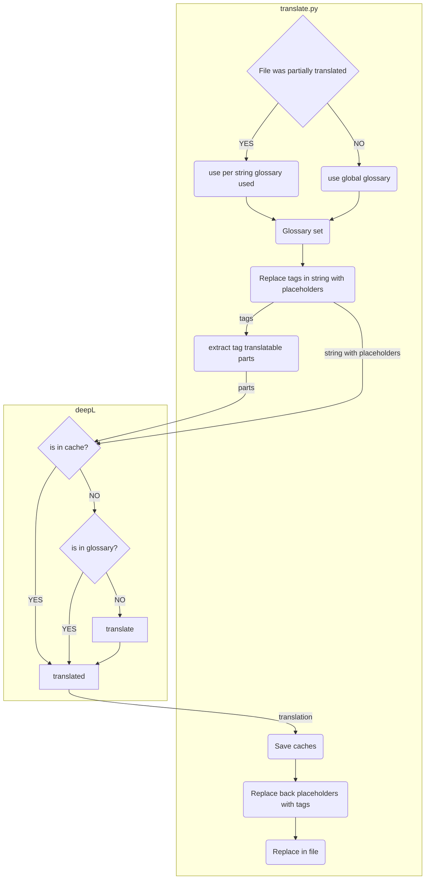

- [Purpose](#purpose)
- [How to use with Plutonium](#how-to-use-with-plutonium)
- [Limitations](#limitations)
  - [Entities names translations](#entities-names-translations)
  - [Weird translations](#weird-translations)
- [Adding glossary](#adding-glossary)
- [Troubleshooting or participating](#troubleshooting-or-participating)
- [Features and todo](#features-and-todo)
- [Deploying locally](#deploying-locally)

---

# Purpose

The purpose of this repository is to provide mirrors of [5etools](https://5e.tools) with the **content** in other languages.
It aims at translating the most as possible without breaking any features.

This project is a fork from the awesome [5etools-translated](https://github.com/5etools-translated/5etools-translated.github.io) that does not seem actively maintained.
This projects no longer offer to switch language on the website because it has grown to big to be deployed on github pages with all the data. Instead there will be several forks and deployments to deploy in each language (which is anyway necessary to use with Plutonium)
This main repository is used to generate translations. Several repositories on another github account are used for deployments

# How to use with Plutonium

-  Open Plutonium Settings
-  Change the `Base Site URL` to the website
-  Tick `Avoid loading local data`
-  Save and refresh your game session


# Limitations
## Entities names translations

5etools syntax is quite complex especially with tags allowing to link data between pages. `{@spell spell_name|book_ref|page}` for example.

For this reason:
- entities names are not translated
- They are only replaced in a 2nd step (in the deployer) if there is a perfect match in the glossary (lowercased)

If the community requests it it could be possible to translate them and save the translation in a shared cache (to ensure translation is the same everywhere) but I am not sure it is better than keeping the known english names.

## Weird translations

Because DeepL has no context and because we sometime translate standalone words (extracted from tags) it can cause some rare misleading translations. As an example "Fire" (spell dmg type) is translated "Incendie" in French.


# Adding glossary

You can submit PRs to add glossary words in your language.
Please note the following points regarding glossary handling:

-  You can add has many json files as you want in the `translation/glossary/$your_lang` folder so try to split in relevant files names. See the [example in french](./translation/glossary/fr/)
-  Glossary will be used if there is a match in the string to translate for your glossary word or its capitalized version.
   -  `lawful` will match `lawful` and `Lawful`.
   -  `Command` will match `Command` but not `command`. This is mostly because some spell names are very common words (aid, command) and it causes weird translations in sentences.
-  We search for exact words. Meaning `spells` will not match `spell` in the glossary. Add plurals for common words if it seems necessary
-  If you add many glossary words at once or very common words (spell, saving throw) it wil cause a LOT of strings to be retranslated and might take several days before the whole content is reprocessed and live.
-  **I (or anyone) will not review the glossary so please proofread you several times.**

# Troubleshooting or participating

You can submit issues or PRs for any encountered problem. Be sure to do it on the [main 5etools-translator repository](https://github.com/5etools-translator-mirror-3/5etools-translator/issues) or the main deployer one.

# Features and todo

-  [x] Translation of translatable content in 5etools "tags" (`{@keyword content|content|...`)
-  [x] Imperial to metric distance conversion
-  [x] Multiple glossary files per lang
-  [ ] Entity and tags translation from glossary only
-  [ ] Maybe find a way to automatically add plural to glossary.

# Deploying locally
Process is the same as the main 5etools website
Note some tech skills are required for this.

-  node and npm must be installed on the machine.
-  Clone this repository
-  Rename the `data` folder to `data.en` and rename `data.yourlang` to `data`
-  Serve 5etools locally

```bash
# install npm http-server (if you do not have it)
npm install -g http-server

# build the site
npm run gen
npm run build
# server
http-server --cors
# add -c2 (cache 2seconds) if you intend to test changes
```

-  By default your site will be accessible at http://localhost:8080




